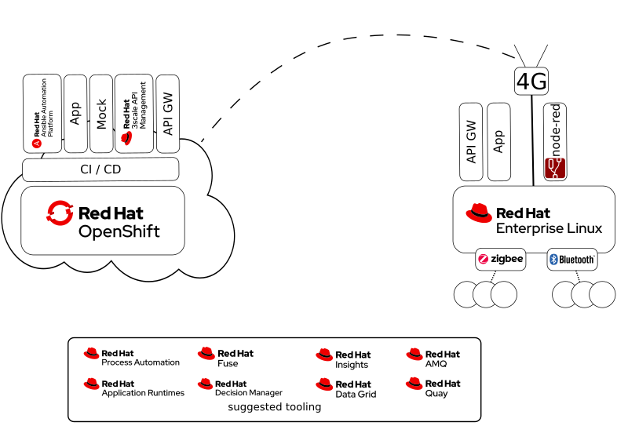

# Red Hat IoT Hack

Welcome to Red Hat IoT hack session. This repository was created for hack session in mind. For the people to get familiar with container based application development and delivery in the automated way. We have setup a lab for such purpose, aim is to provide skeleton for cloud native development environment, but in home automation nerdy way.

The environment consists of resources the hybrid way. There is OpenShift somewhere in the cloud, which hosts variety of tooling and technologies. We also have a remote physical embedded RHEL server acting as IoT gateway. The RHEL box has couple of radios connected to it, which may be used to connect to physical peripherals common to home automation.

The task depend of course on the audience. During the first event we utilise the following devices:

 * Zigbee USB radio stick
 * Ikea Trådfri Gateway (Zigbee)
 * Ikea Trådfri lamp (Zigbee)
 * Ikea Trådfri remote controller (Zigbee)
 * Zigbee temperature sensor
 * Bluetooth temperature/humidity sensor
 * Any bluetooth devices nearby?
 * WLAN network

<TBD, pic here about the devices on the table>

# Goal of the day

We have all Red Hat products for use for the excersise. Using them is up to your imagination. Our idea on high level is to develope software that has cloud backend, and local software in the IoT gateway box. The local software makes use of the radio devices to connect to peripherals. They may be commanded to do something, and monitored for events or status. The info is carried over the internet to cloud, where the backend software will possibly act on info, or provide ways to control the devices.

It is highly encouraged to make use of available technology, including but not limited to:

* [Red Hat 3Scale](https://www.redhat.com/en/technologies/jboss-middleware/3scale) API management and gateways
* [Red Hat Ansible Automation](https://www.redhat.com/en/technologies/management/ansible) Tower for automation and end device control
* OpenShift for
  * building containers
  * CI/CD pipelines for applications, together with Tower to deliver the apps to RHEL target
  * hosting and publishing the cloud applications
* [Red Hat Decision Manager]() for acting on device status or control events
* [Red Hat Datagrid for in memory database](https://www.redhat.com/en/technologies/jboss-middleware/data-grid)
* [Red Hat Process Automation Manager](https://www.redhat.com/en/technologies/jboss-middleware/process-automation-manager) for handling external approvals or inputs
* [Red Hat Runtimes](https://www.redhat.com/en/products/runtimes) for application development
* [Red Hat AMQ](https://www.redhat.com/en/technologies/jboss-middleware/amq) for messaging events e.g. via Kafka
* [Red Hat Single Sign On](https://access.redhat.com/products/red-hat-single-sign-on?extIdCarryOver=true&sc_cid=701f2000001OH6fAAG) for identification
* [Quarkus](https://quarkus.io/) for highly optimized java programming
* Red Hat [Insights](https://www.redhat.com/en/technologies/management/insights) and [Cockpit](https://cockpit-project.org/) to get visibility, security and control to RHEL box. 

And of course any software you feel like using there! For example we have [Node-Red](https://nodered.org/) installed for easy data flow management.

# Instructions

* TBD [Description of OpenShift resources](./)
* TBD [Description of controlling RHEL box](./rhel-device/README.md)
* TBD [Description of moving containers from OCP to RHEL box](./)

# External blogs for ideas and documentation

* Search topics on [Red Hat Developer Blog](https://developers.redhat.com/blog/)
* [How to Install Red Hat Process Automation Manager 7.5 in Minutes](http://www.schabell.org/2020/01/)how-to-install-red-hat-process-automation-manager-75-in-minutes.html
* [How to Install Red Hat Decision Manager 7.5 in Minutes](http://www.schabell.org/2020/01/how-to-install-red-hat-decision-manager-75-in-minutes.html)

# Product documentation

[Click here for Red Hat product documentation](https://access.redhat.com/documentation/en-us/).

* <TBD, list of direct links to product documentation>